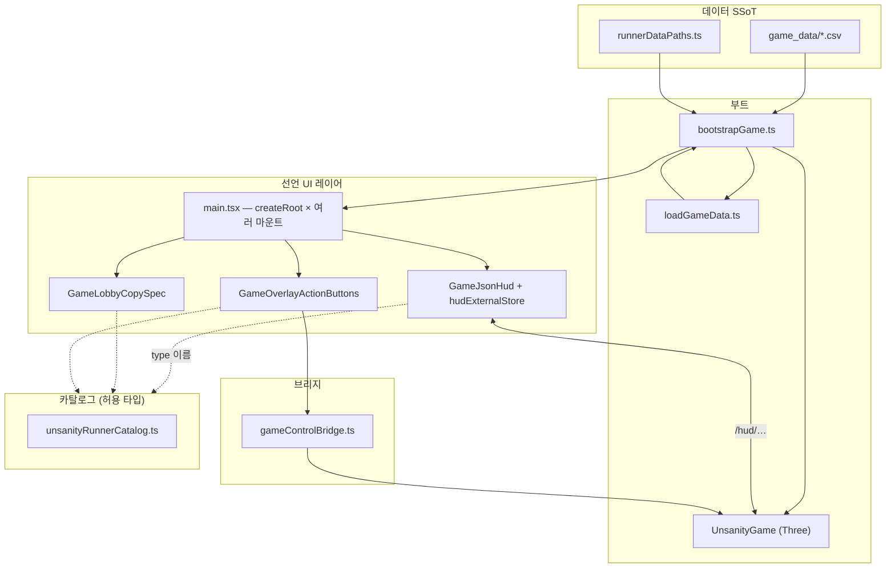

# Unsanity Runner — 개발 구조 핸드북 (세션·학습용)

> **이 파일의 역할**  
> 다음 채팅, 새로 합류한 구현자, 외부 에이전트가 **“레포 전체가 어떻게 묶이는지”** 를 빠르게 따라잡기 위한 요약이다.  
> **세부 이론·연구 Phase·연대기**는 `docs/JSON_RENDER_Unsanity_Guide.md`(통합본)를 본다.  
> **금지·금지·기획 헌법·DOM 체크리스트**는 레포 루트 `GAME_unsanity_runner.md` 를 본다.

---

## 1. 한 장 다이어그램 (머릿속에 넣을 것)



읽는 법:

- **굵은 줄기 두 개**: (1) `bootstrapGame` → **Three 플레이**, (2) `main.tsx` → **DOM + React + json-render**.  
- **HUD 숫자/문구**는 `UnsanityGame.pushHudChrome()` 이 **`hudExternalStore`** 를 갱신하고, Spec은 `{ $state: "/hud/…" }` 로 읽는다.  
- **시작·다시** 버튼은 React가 Spec 액션을 쏘고, **`gameControlBridge`** 가 `UnsanityGame` 의 메서드와 연결된다.

---

## 2. 부트 순서 (실행 시간 순서)

1. 브라우저가 **`index.html`** 로드 → `#game-viewport`, `#jr-hud-widgets`, 로비 마운트 지점 등 DOM이 존재한다.  
2. **`src/main.tsx`** 진입 → **`bootstrapGame()`** 먼저 호출된다.  
3. **`bootstrapGame.ts`**  
   - `import.meta.glob` 으로 CSV 원문 로드 → `runnerDataPaths` 정합 검사  
   - `buildRawGameDataSheets` → `loadGameData` → **`LoadedGameData`**  
   - `bootstrapDomTexts` 로 `[data-text-id]` 줄 채움 (`index.html` 정적 카피)  
   - **`new UnsanityGame(mount, data)`** — WebGL이 `#game-viewport` 자식으로 붙음  
   - `LoadedGameData` 반환 (`main.tsx` 에서 카피·HUD 라벨에 사용)  
4. **`main.tsx`** 후반 — `document.getElementById(...)` 로 잡히는 각 노드마다 **`createRoot` + StrictMode**  
   - 로비 헤더 / 스타터 힌트 / HUD / 시작 버튼 / 게임오버 다시 버튼  
5. 플레이 중 · 게임오버 시 화면 전환은 **`UnsanityGame.applyPhaseUi()`** 가 **`#start-screen`, `#gameover-screen`, `#play-hud`** 의 `hidden` 등을 바꿔 처리한다.

**주의**: `main.tsx` 에서 마운트하는 **id 문자열과 `index.html` 의 id 가 1글자라도 어긋나면 해당 React 트리는 조용히 스킵**된다. 구조 수정 시 두 파일을 **세트**로 본다.

---

## 3. 디렉터리·파일 역할표 (추적용)

| 구역 | 경로 | 책임 |
|------|------|------|
| 엔트리 | `index.html`, `src/main.tsx` | DOM 뼈대 + React 마운트 위치 정의 |
| 부트·데이터 | `src/bootstrapGame.ts`, `src/game/loadGameData.ts`, `src/game/runnerDataPaths.ts` | CSV → 런타임 데이터 · DEV 검증 |
| 플레이 코어 | `src/game/UnsanityGame.ts` | 페이즈, Three 씬, 충돌, 스폰, `pushHudChrome`, `qs('…')` DOM 반영 |
| HUD 상태 | `src/game/hudExternalStore.ts`, `pushHudChrome` | `/hud/…` 플랫 상태 — Spec과 세트 수정 |
| 액션 브리지 | `src/game/gameControlBridge.ts` | React 액션 → `startRun` / `backToTitle` |
| json-render HUD | `src/jsonRender/GameJsonHud.tsx` | `playHudSpec` + `registry` |
| 로비 카피 | `src/jsonRender/GameLobbyCopySpec.tsx`, `lobbyStarterHintSpec.ts` | 선언 카피 + 외부 JSON POC |
| 오버레이 버튼 | `src/jsonRender/GameOverlayActionButtons.tsx` | `runnerStartRound` / `runnerReturnToLobby` |
| 카탈로그 진입 | `src/catalog/unsanityRunnerCatalog.ts` | `defineCatalog` 한 번에 병합 |
| 운영 UI 타입 | `src/catalog/runnerCatalogOperationalUi.ts` | HUD·로비·버튼 — **registry JSX와 짝 필수** |
| 재료·스텁 | `src/catalog/runnerCatalogStubsAndMaterials.ts` | CSV 재료 + 시맨틱 이름 — 보통 JSX registry 없음 |
| 공통 Zod | `src/catalog/runnerCatalogShared.ts` | `hudBindProp`, 스텝용 ref 스키마 |
| 에셋 3D | `src/game/actorMeshes.ts` | 메시 생성·dispose 규약 |
| 스타일 | `src/style.css` | 스케치/잉크 톤, 오버레이·HUD 레이아웃 |

각 카탈로그 파일 **첫 줄**에 `@runner-catalog-role` 태그 주석이 있으면 브라우즈·검색에 도움이 된다(레포 상태에 따라 있을 수 있음).

---

## 4. `package.json` 스크립트 (재현 방법)

| 명령 | 용도 |
|------|------|
| `npm run dev` | 로컬 개발 서버(Vite 기본 포트 또는 `--port` 지정 시 해당 포트). |
| `npm run build` | `dist/` 프로덕션 번들 생성. |
| `npm run build:zip` | `build` 후 **`dist/` 내용물**으로 루트에 **`GAME_unsanity_runner-web.zip`** 생성 — 정적 호스팅 업로드용. |
| `npm run preview` | `dist/` 미리보기 서버. |
| `npm run typecheck` | `tsc --noEmit`. **반드시** `build`와 함께 주기적으로 돌릴 것 — Vite 빌드만으로는 미사용·타입 오류를 놓치기 쉽다. |

**의존성**: `@json-render/core`, `@json-render/react`, `react`, `react-dom`, `zod`, `three` 는 `package.json` 의 **`dependencies`** 에 명시해 두었다. 과거처럼 **`package-lock`만 최신인데 JSON은 빈 것**이 되면 새 클론에서 혼란이 생긴다.

---

## 5. 카탈로그 vs registry vs Spec — 수정 시 순서

1. 새 **운영 UI 블록**을 넣었다면  
   **`runnerCatalogOperationalUi`** 에 컴포넌트 등록(Zod 포함) → **대응 `registry` JSX** (`GameJsonHud` / Lobby / Overlay 중 하나) → **Spec 노드 추가** (`type` 문자열 일치).  
2. 새 **HUD 동적 필드**를 추가했다면  
   **`hudExternalStore` 초깃값** → **`pushHudChrome` 갱신** → **Spec 의 `$state` 경로 문자열** → 필요 시 카탈로그 **`hudBindProp`**.

“카탈로그 이름만 생기고 registry 없음” 은 허용되는 패턴일 수 있으나(**스텁·연구**) **운영 HUD/버튼**에서 그 상태면 조용히 비어 보인다 — 통합본 §4.2·§4.3 과 같이 읽기.

---

## 6. 작업 종류별 체크리스트

### A. 플레이 감각·연출만 (충돌·스폰·애니)

- 우선 수정 범위: `UnsanityGame.ts`, `actorMeshes.ts`, CSV 튜닝 필드 등.  
- **피해야 할 패턴**: `loop()` 안에서 같은 시스템을 **두 번 update** 하는 복붙 블록(프레임 비용·상태 깜빡임).  
- 완료 전: **`npm run typecheck`**, **`npm run build`**.

### B. DOM 마크업·복사 줄

- 수정 세트: `index.html` + (해당 카피가 React라면) `main.tsx` / `textCopyIds.ts` / `05_text_strings.csv`.  
- `data-text-id` 만 쓰는 줄은 **`bootstrapDomTexts`** 가 채운다 — React 라인과 중복 책임이 없게 정리했다는 걸 확인.

### C. json-render 카피·버튼

- 수정 세트: 관련 **`src/jsonRender/*.tsx`**, 사용하는 **Spec 문자열**, **카탈로그**(props).  
- 액션 추가 시: **`unsanityRunnerCatalog.ts`** `actions` + **`gameControlBridge`** + `UnsanityGame` 에서 처리.

### D. 새 CSV 재료 줄

- 한 세트: `runnerDataPaths.ts` 등 ORDER/MANIFEST → 파서/loadGameData 계열 → **`runnerCatalogStubsAndMaterials`** 재료 블록 → DEV **`runnerDataMaterialRegistry`** 정합 참고.

---

## 7. 배포 번들(zip)

`npm run build:zip` 으로 생기는 **`GAME_unsanity_runner-web.zip`** 은 **`dist/` 루트와 동일**한 구조다 (압축 해제 후 **`index.html` 이 사이트 루트**에 오도록 맞춤).

정적 서버에서는 **MIME·경로(case)** 만 맞으면 동일하게 동작한다.

---

## 8. 새 세션 시작 시 다른 AI에게 붙일 블록 (복사용)

```
GAME_unsanity_runner — Vite TS 런너.
먼저 읽을 문서 순서:
1) GAME_unsanity_runner.md (헌법·DOM 금기)
2) docs/DEVELOPMENT_STRUCTURE.md (이 파일 — 구조·부트 순서·체크리스트)
3) docs/JSON_RENDER_Unsanity_Guide.md — 필요 시 카탈로그·연구 디테일

코어 줄기:
- 플레이 코어는 UnsanityGame.ts (명령형 Three).
- DOM HUD/로비/버튼은 main.tsx 에서 여러 React 루트 + json-render.
- HUD 숫자는 hudExternalStore + pushHudChrome; Spec 에서 $state 로 읽음.
- 버튼 액션은 gameControlBridge.ts 가 UnsanityGame 과 연결.

완료 시: npm run typecheck && npm run build ; 배포 zip 은 npm run build:zip
```

---

## 9. 변경 이력 (문서 관리 메모)

- **2026-05-14** — 학습·세션 넘김용으로 초안 작성. 배포 명령 `build:zip` 과 스크립트 표를 포함한다.

이 문서 내용과 실제 패키지 스크립트·경로가 어긋나면 **`package.json`** 과 이 파일의 **표·절 차** 중 **항상 패키지·코드를 우선**하고, 차기 커밋으로 본 파일을 업데이트한다.
